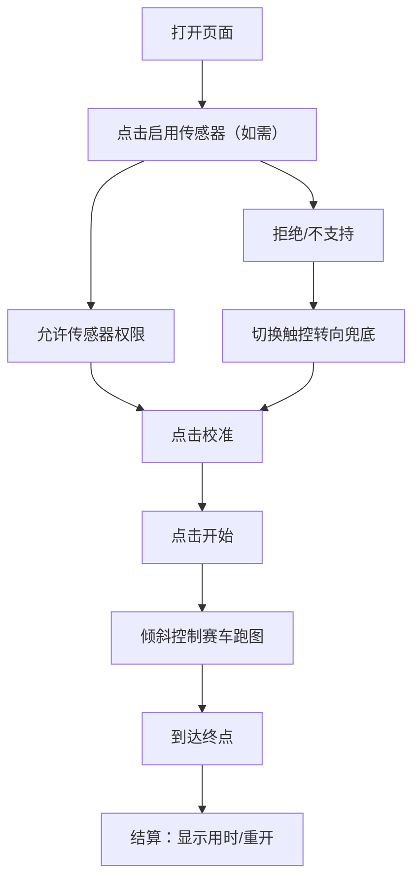

## 1. 产品概述
在手机浏览器中运行的轻量赛车演示：用户倾斜手机像握方向盘一样控制车辆左右转向，沿着赛道前进并完成计时。
- 目标用户：比赛评委/观众，移动端试玩用户
- 核心价值：快速展示“陀螺仪控制 + 跑图 + 可玩闭环”的最小可行原型

## 2. 核心功能

### 2.1 功能模块
1. **开始/设置层**：启用传感器、校准中位、调节灵敏度、开始游戏
2. **游戏层（Canvas）**：车辆前进、倾斜转向、边界限制/出界惩罚、计时展示
3. **结算层**：展示用时、重开

### 2.2 页面明细
| 页面名称 | 模块名称 | 功能描述 |
|---|---|---|
| 单页应用（/） | 顶部HUD | 显示用时、速度（可选）、当前输入模式（传感器/触控） |
| 单页应用（/） | 开始/设置层 | 传感器授权按钮（iOS）、校准按钮、灵敏度滑杆、开始按钮 |
| 单页应用（/） | 游戏Canvas | 2D俯视渲染，车辆、赛道、边界；每帧更新与碰撞/限制 |
| 单页应用（/） | 结算层 | 完成提示、用时、重开 |

## 3. 核心流程
1. 用户打开页面
2. 点击“启用传感器”（iOS必须），允许后显示实时倾斜数值
3. 点击“校准”将当前握持角度设为中位
4. 点击“开始”进入游戏
5. 倾斜手机控制车辆在赛道中前进并到达终点
6. 结算页展示用时，可重开

## 4. 界面设计
### 4.1 设计风格
- 风格方向：比赛演示优先的“赛车仪表盘”风格（暗色、霓虹点缀、清晰可读）
- 主色：深色背景（近黑/石墨灰）
- 点缀色：青绿或琥珀作为速度/转向状态强调
- 字体：系统默认字体（减少资源体积与加载开销）
- 交互：大按钮、滑杆、可单手操作；提供触控兜底提示

### 4.2 页面设计概览
| 页面名称 | 模块名称 | UI元素 |
|---|---|---|
| 单页应用（/） | HUD | 用时、模式标签、重开按钮（游戏中可选隐藏） |
| 单页应用（/） | 设置层 | 启用传感器按钮、校准按钮、灵敏度滑杆、开始按钮、提示文案 |
| 单页应用（/） | Canvas | 居中画布、适配横竖屏、背景网格/赛道纹理（程序生成优先） |

### 4.3 响应式
- 移动端优先：适配常见屏幕比例，Canvas 自适应缩放
- 横竖屏都可跑：竖屏默认；横屏可自动扩大可视区域
