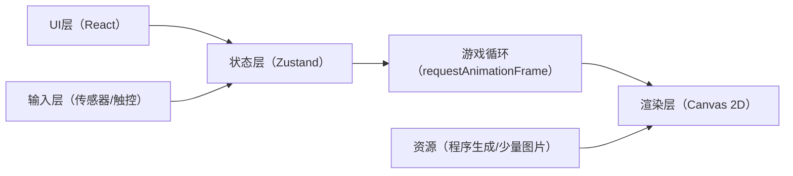

## 1. 架构设计
本项目为纯前端单页应用：React 负责UI与状态，Canvas 负责渲染与游戏循环，传感器输入模块提供“倾斜转向”与触控兜底。

## 2. 技术说明
- 前端：React + TypeScript + Vite
- 样式：Tailwind（仅用于UI层，Canvas 渲染不依赖 Tailwind）
- 状态管理：Zustand（集中管理游戏状态、校准值、灵敏度、输入模式）
- 后端：无
- 数据：本地内存（MVP 不做持久化）

## 3. 路由定义
| 路由 | 用途 |
|---|---|
| / | 单页：包含设置层、Canvas游戏层、结算层 |

## 4. 模块划分（建议）
- src/game：游戏世界、车辆、赛道、碰撞/限制、渲染
- src/input：传感器输入（DeviceMotion/DeviceOrientation）与触控兜底输入
- src/store：Zustand 状态与动作（开始/重开/校准/设置灵敏度）
- src/pages：单页容器（组合HUD、设置层、画布）

## 5. 关键实现要点
- iOS 权限：通过用户点击触发 requestPermission（存在则调用），否则提示触控模式
- 倾斜取值：优先使用 DeviceMotionEvent.accelerationIncludingGravity 的 x 分量作为左右倾斜基准
- 校准：记录当前倾斜为 x0，中位 = x - x0
- 平滑：对输入做低通滤波（lerp），避免抖动与“手一抖车就飞”
- 兜底：无权限/无事件/数值异常时，自动切触控（左右拖动或虚拟方向盘）
